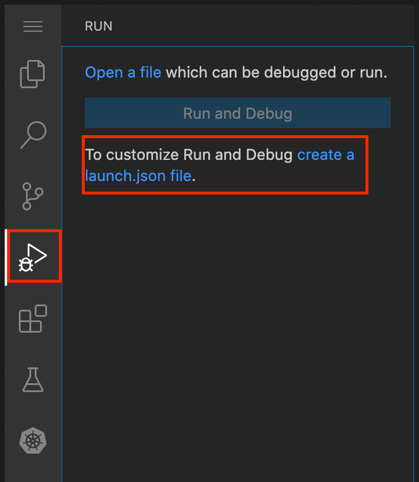

To debug our application running in Kubernetes we need to create a remote debug configuration in our IDE. This will work for any remote process (doesn’t have to be running in Kubernetes).


```dashboard:open-dashboard
name: Editor
```

On the left hand side of the IDE tab, click the Run/Debug icon.

Click the `create a launch.json file` link in the Run/Debug panel.




The IDE will create a default launch configuration for the current file and for `K8sDemoAppApplication`.
We need to add another configuration for remote debugging.

Copy and paste the following JSON snippet into your `launch.json` *ABOVE* the first json entry.
```workshop:copy
text: |-
        {
            "type": "java",
            "name": "Debug (Attach)",
            "request": "attach",
            "hostName": "localhost",
            "port": 5005
        },
```

Now select the `Debug (Attached)` option from the drop down and click the Run button

This should attach the debugger to the remote port


Now you can execute the following command to make a request to the application.  The debugger in the IDE should
break at our breakpoint, at which point you can step through the code, view variable values, etc.

```execute-2
curl localhost:4503
```


---
